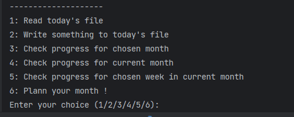

# 📅 Planner Tekstowy

### **Intuicyjna aplikacja do organizacji czasu w formie plików tekstowych.**

Planner pozwala użytkownikowi zapisywać krótkie notatki, przemyślenia, zadania oraz kluczowe terminy w oddzielnych plikach tekstowych.  
Każdy miesiąc jest podzielony na tygodnie, co ułatwia wizualizację dostępnego czasu i organizację zadań.

---

## 🎥 **Podgląd aplikacji**



## 🚀 **Funkcjonalność**
✅ Tworzenie i organizacja notatek w plikach tekstowych  
✅ Możliwość wyboru ścieżki do zapisu planera  
✅ Podział miesiąca na tygodnie dla lepszej wizualizacji  
✅ Dodawanie, usuwanie i edytowanie wpisów  
✅ Podgląd wszystkich notatek z danego miesiąca  

---

## 🛠 **Technologie**
Projekt został napisany w **Pythonie** i wykorzystuje następujące moduły:
- `os` – obsługa systemu plików
- `pathlib` – operacje na ścieżkach plików
- `calendar` – organizacja dni i tygodni
- `datetime` – operacje na datach

---

## ⚙️ **Instalacja i uruchomienie**
1. **Sklonuj repozytorium**  
   ```sh
   git clone https://github.com/eXegiMonumentum/python-txt-calendar.git
